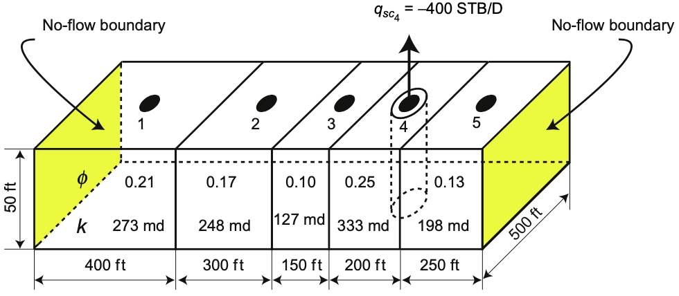
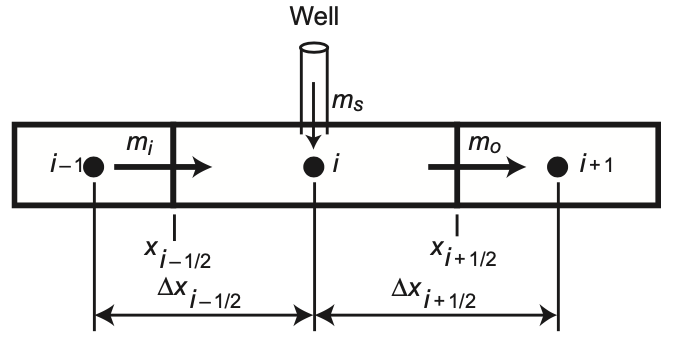
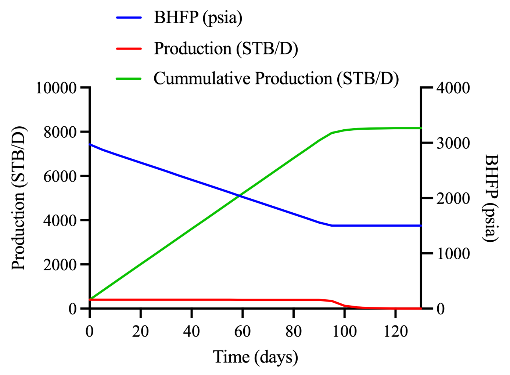

# Petroleum Reservoir Simulation with Python
Amedeka Emperor
Email: amedekaemperor@gmail.com
Net-Zero Carbon Emission Lab, KNUST



---
## Contents
1. Basic principles
2. Derivation of PDE
3. Discretization of PDE in space and time
4. Initial and boundary conditions
5. Well representation
6. Single phase flow
7. Transmissibility
8. Method of solution of linear equations (Thomas' algorithm)
9. Single phase 1D slightly compressible implicit reservoir simulation with Python

---

## Basic principles

* Mass conservation: $m_i-m_o+m_s=m_a$
* Fluid flow rate (Darcy's law): $u_x=q_x/A_x=-\frac{k_x}{\mu} \frac{\partial p}{\partial x}$



---

## Derivation of PDE
* Mass rate, $w=m/t=\rho u A$
* Density, $\rho = m/V_p$
* Pore volume, $V_p = V_b \phi$
* Volumetric rate, $q = q_s/\rho$
$$
\begin{align}

m_i-m_o+m_s &= m_a \\

w_i \Delta t - w_o \Delta t + q_s \Delta t &= V_b\Delta_t (\phi \rho) \\

(\rho u_x A_x)_i \Delta t - (\rho u_x A_x)_o \Delta t + \rho q \Delta t &= V_b\Delta_t (\phi \rho) \\

\frac{(\rho u_x A_x)_i - (\rho u_x A_x)_o + \rho q}{V_b} &= \frac{\Delta_t (\phi \rho)}{\Delta t} \\

\frac{(\rho u_x)_i - (\rho u_x)_o}{\Delta x} + \frac{\rho q}{V_b} &= \frac{\Delta_t (\phi \rho)}{\Delta t} \\

\end{align}
$$

---

## Derivation of PDE
$$
\begin{align}

\frac{-[(\rho u_x)_o - (\rho u_x)_i]}{\Delta x} + \frac{\rho q}{V_b} &= \frac{\Delta_t (\phi \rho)}{\Delta t} \\

\lim_{\Delta x \to 0} \frac{-[(\rho u_x)_o - (\rho u_x)_i]}{\Delta x} + \frac{\rho q}{V_b} &= \lim_{\Delta t \to 0}\frac{\Delta_t (\phi \rho)}{\Delta t} \\

-\frac{\partial (\rho u_x)}{\partial x} + \frac{\rho q}{V_b} &= \frac{\partial (\phi \rho)}{\partial t} \\

\frac{\partial}{\partial x}\left(\frac{k_x}{\mu}\frac{\partial p}{\partial x}\right) + \frac{\rho q}{V_b} &= \frac{\partial (\phi \rho)}{\partial t}

\end{align}
$$

* Formation volume factor, $B=\rho_{sc}/\rho$
$$
\begin{align}

\frac{\partial}{\partial x}\left(\frac{k_x}{\mu B}\frac{\partial p}{\partial x}\right) + \frac{q_{sc}}{V_b} &= \frac{\partial}{\partial t}\left(\frac{\phi}{B}\right)

\end{align}
$$

---
## Discretization of PDE in space and time
* Volume, $V=A\Delta x$
* For gridblock $i$,

$$
\begin{align}

\frac{\partial}{\partial x}\left(\frac{A_x k_x}{\mu B}\frac{\partial p}{\partial x}\right)_i \Delta x_i + q_{sc_i} &= V_{b_i} \frac{\partial}{\partial t}\left(\frac{\phi}{B}\right)_i \\

\frac{\partial}{\partial x}\left(\frac{A_x k_x}{\mu B}\frac{\partial p}{\partial x}\right)_i &\approx \left[\left(\frac{A_x k_x}{\mu B}\frac{\partial p}{\partial x}\right)_{i+1/2} - \left(\frac{A_x k_x}{\mu B}\frac{\partial p}{\partial x}\right)_{i-1/2}\right] /\Delta x \\

\frac{\partial}{\partial x}\left(\frac{A_x k_x}{\mu B}\frac{\partial p}{\partial x}\right)_i \Delta x_i &\approx \left[\left(\frac{A_x k_x}{\mu B \Delta x}\right)_{i+1/2} (p_{i+1}-p_i) - \left(\frac{A_x k_x}{\mu B \Delta x}\right)_{i-1/2}(p_{i}-p_{i-1})\right] \\

\frac{\partial}{\partial x}\left(\frac{A_x k_x}{\mu B}\frac{\partial p}{\partial x}\right)_i \Delta x_i &\approx T_{i+1/2} (p_{i+1}-p_i) - T_{i-1/2}(p_{i}-p_{i-1})

\end{align}
$$

---
## Discretization of PDE in space and time

$$
\begin{align}

T_{i+1/2} (p_{i+1}-p_i) - T_{i-1/2}(p_{i}-p_{i-1}) + q_{sc_i} &\approx V_{b_i} \frac{\partial}{\partial t}\left(\frac{\phi}{B}\right)_i \\

T_{i-1/2} (p_{i-1}-p_i) + T_{i+1/2}(p_{i+1}-p_{i}) + q_{sc_i}&\approx V_{b_i} \frac{\partial}{\partial t}\left(\frac{\phi}{B}\right)_i \\

\frac{\partial}{\partial t}\left(\frac{\phi}{B}\right)_i &\approx \frac{1}{\Delta t} \left[ \left(\frac{\phi}{B}\right)_i^{n+1} - \left(\frac{\phi}{B}\right)_i^n \right]

\end{align}
$$
---
## Discretization of PDE in space and time
* Forward-difference discretization (Explicit)

$$
\begin{align}

T_{i-1/2}^n (p_{i-1}^n-p_i^n) + T_{i+1/2}^n(p_{i+1}^n-p_{i}^n) + q_{sc_i}^n &\approx \frac{ V_{b_i}}{\Delta t} \left[ \left(\frac{\phi}{B}\right)_i^{n+1} - \left(\frac{\phi}{B}\right)_i^n \right] \\

T_{i-1/2}^n (p_{i-1}^n-p_i^n) + T_{i+1/2}^n(p_{i+1}^n-p_{i}^n) + q_{sc_i}^n &\approx \frac{ V_{b_i}}{\Delta t} \left( \frac{\phi}{B} \right)^{'}_i \left[ p_i^{n+1} - p_i^n \right] \\

\left( \frac{\phi}{B} \right)^{'}_i = \left[ \left(\frac{\phi}{B}\right)_i^{n+1} - \left(\frac{\phi}{B}\right)_i^n \right]/\left[ p_i^{n+1} - p_i^n \right]

\end{align}
$$

---
## Discretization of PDE in space and time
* Backward-difference discretization (Implicit)

$$
\begin{align}

T_{i-1/2}^{n+1} (p_{i-1}^{n+1}-p_i^{n+1}) + T_{i+1/2}^{n+1}(p_{i+1}^{n+1}-p_{i}^{n+1}) + q_{sc_i}^{n+1} &\approx \frac{ V_{b_i}}{\Delta t} \left( \frac{\phi}{B} \right)^{'}_i \left[ p_i^{n+1} - p_i^n \right] \\


\end{align}
$$
---

## Initial and boundary conditions
* Specified boundary pressure, $p_b$

$$
\begin{align}

\left[ \frac{k_x A_x}{\mu B(\Delta x)/2} \right]_{bB}(p_b - p_i)\\

\end{align}
$$

* Specified boundary pressure-gradient, $\partial p/\partial x$

$$
\begin{align}

\mp \left[ \frac{k_x A_x}{\mu B} \right]_{bB} \frac{\partial p}{\partial x}

\end{align}

$$

---

## Well representation
* Specified well pressure gradient, $\partial p/\partial r$

$$
\begin{align}

q_{sc_i} = -\frac{2\pi r_w k h}{B\mu}\frac{\partial p}{\partial r}

\end{align}
$$

* Specified well FBHP, $p_{wf}$

$$
\begin{align}

q_{sc_i} &= -\frac{2\pi k h}{B\mu [\log_e(r_{eq}/r_w)+s]}(p_i - p_{wf})\\

q_{sc_i} &= -G(p_i - p_{wf})\\

r_{eq}=0.14[(\Delta x)^2+(\Delta y)^2]^{0.5}

\end{align}

$$

---

## Single phase flow
* Incompressible flow, $c_{\phi}=0$
$\phi = \phi^{\cdot}[1+c_{\phi}(p-p^{\cdot})] \\$

$$
\begin{align}


T_{i-1/2} (p_{i-1}-p_i) + T_{i+1/2}(p_{i+1}-p_{i}) + q_{sc_i}&\approx \frac{ V_{b_i}}{\Delta t} \left[ \left(\frac{\phi}{B}\right)_i^{n+1} - \left(\frac{\phi}{B}\right)_i^n \right] \\

\frac{ V_{b_i}}{\Delta t} \left[ \left(\frac{\phi}{B}\right)_i^{n+1} - \left(\frac{\phi}{B}\right)_i^n \right] &= \frac{ V_{b_i}\phi_i^{\cdot} c_{\phi}}{B\Delta t} \left[ p_i^{n+1} - p_i^n \right] = 0 \\

T_{i-1/2} (p_{i-1}-p_i) + T_{i+1/2}(p_{i+1}-p_{i}) + q_{sc_i}&\approx 0 \\

\end{align}

$$

---

## Single phase flow
* Slightly compressible flow, 

$$
\begin{align}

\frac{ V_{b_i}}{\Delta t} \left[ \left(\frac{\phi}{B}\right)_i^{n+1} - \left(\frac{\phi}{B}\right)_i^n \right] &\approx \frac{ V_{b_i}\phi_i^{\cdot} (c_{\phi}+c)}{B\Delta t} \left[ p_i^{n+1} - p_i^n \right] \\

T_{i-1/2} (p_{i-1}-p_i) + T_{i+1/2}(p_{i+1}-p_{i}) + q_{sc_i}&\approx \frac{ V_{b_i}\phi_i^{\cdot} (c_{\phi}+c)}{B\Delta t} \left[ p_i^{n+1} - p_i^n \right] \\

\end{align}

$$

---

## Transmissibility

$$
\begin{align}

T_{i,i\pm1} = T_{i\mp1/2} = \frac{1}{\mu B}\times\frac{2}{\Delta x_i /(A_{x_i}k_{x_i}) + \Delta x_{i\mp1} /(A_{x_{i\mp1}}k_{x_{i\mp1}})}

\end{align}

$$

---

## Methods of solution of linear equations (Thomas' algorithm)

* Incompressible flow

$$
\begin{align}

T_{i-1/2} (p_{i-1}-p_i) + T_{i+1/2}(p_{i+1}-p_{i}) + q_{sc_i} &= 0 \\

T_{i-1/2}p_{i-1} - T_{i-1/2}p_i + T_{i+1/2}p_{i+1} - T_{i+1/2}p_i &= - q_{sc_i} \\

T_{i-1/2}p_{i-1} - (T_{i-1/2}p_i + T_{i+1/2}p_i)+ T_{i+1/2}p_{i+1}  &= - q_{sc_i} \\

T_{i-1/2}p_{i-1} - (T_{i-1/2} + T_{i+1/2})p_i+ T_{i+1/2}p_{i+1}  &= - q_{sc_i} \\


\end{align}

$$

* Sligthly compressibile flow

$$
\begin{align}


T_{i-1/2} (p_{i-1}^{n+1}-p_i^{n+1}) + T_{i+1/2}(p_{i+1}^{n+1}-p_{i}^{n+1}) + q_{sc_i}^{n+1}&\approx \frac{ V_{b_i}\phi_i^{\cdot} (c_{\phi}+c)}{B\Delta t} \left[ p_i^{n+1} - p_i^n \right] \\

T_{i-1/2}p_{i-1}^{n+1} - \left(T_{i-1/2} + T_{i+1/2} + \frac{ V_{b_i}\phi_i^{\cdot} (c_{\phi}+c)}{B\Delta t}\right)p_i^{n+1}+ T_{i+1/2}p_{i+1}^{n+1}  &= - q_{sc_i}^{n+1} - \frac{ V_{b_i}\phi_i^{\cdot} (c_{\phi}+c)}{B\Delta t}p_i^n \\

\end{align}
$$
---

## Methods of solution of linear equations (Thomas' algorithm)

* The equation for block, $i$
$$
\begin{align}
w_ix_{i-1}+c_ix_i+e_ix_{i+1}=d_i
\end{align}
$$


* For example, for incompressible flow
$$
\begin{align}
w_i=T_{i-1/2},c_i=- (T_{i-1/2} + T_{i+1/2}), e_i=T_{i+1/2}, d_i=- q_{sc_i}
\end{align}
$$


---

## Methods of solution of linear equations (Thomas' algorithm)

* Alogrithm
    1. Set $u_1=e_1/c_1$ and $g_1=d_1/c_1$
    2. For $i=2, 3,...,N-1$, 
    $u_i=e_i/(c_i-w_iu_{i-1})$ and
    For $i=2, 3, ..., N,$
     $g_i=(d_i-w_ig_{i-1})/(c_i-w_iu_{i-1})$
    3. Set $x_N=g_N$
    4. For $i=N-1, N-2, ..., 3, 2, 1$,
    $x_i=g_i-u_ix_{i+1}$


---


## Case study

 Reservoir fluid properties are $B=1 RB/STB$, $\mu=1.5 cp$, and $c=2.5\times10^{-5}psi^{-1}$. Initially, reservoir pressure is $3000psia$. A $6in$ vertical well was drilled at the center of gridblock 4. The well is switched to a constant FBHP of $1500 psia$ if the reservoir cannot sustain the specified production rate. Find the pressure distribution in the reservoir after 10 days using the implicit formulation. 


---


## Case study: Single phase 1D slightly compressible implicit reservoir simulation
$$
\begin{align}
T_{i-1/2} (p_{i-1}^{n+1}-p_i^{n+1}) + T_{i+1/2}(p_{i+1}^{n+1}-p_{i}^{n+1}) + q_{sc_i}^{n+1}&\approx \frac{ V_{b_i}\phi_i^{\cdot} (c_{\phi}+c)}{B\Delta t} \left[ p_i^{n+1} - p_i^n \right] \\


T_{i-1/2}p_{i-1}^{n+1} - \left(T_{i-1/2} + T_{i+1/2} + \frac{ V_{b_i}\phi_i^{\cdot} (c_{\phi}+c)}{B\Delta t}\right)p_i^{n+1}+ T_{i+1/2}p_{i+1}^{n+1}  &= - q_{sc_i}^{n+1} - \frac{ V_{b_i}\phi_i^{\cdot} (c_{\phi}+c)}{B\Delta t}p_i^n \\

T_{i-1/2}p_{i-1}^{n+1} - \left(T_{i-1/2} + T_{i+1/2} + \frac{ V_{b_i}\phi_i^{\cdot} (c_{\phi}+c)}{B\Delta t}\right)p_i^{n+1}+ T_{i+1/2}p_{i+1}^{n+1}  &= G(p_i^{n+1} - p_{wf}) - \frac{ V_{b_i}\phi_i^{\cdot} (c_{\phi}+c)}{B\Delta t}p_i^n \\

T_{i-1/2}p_{i-1}^{n+1} - \left(T_{i-1/2} + T_{i+1/2} + \frac{ V_{b_i}\phi_i^{\cdot} (c_{\phi}+c)}{B\Delta t}+G\right)p_i^{n+1}+ T_{i+1/2}p_{i+1}^{n+1}  &= -Gp_{wf} - \frac{ V_{b_i}\phi_i^{\cdot} (c_{\phi}+c)}{B\Delta t}p_i^n \\

w_ip_{i-1}^{n+1} + c_ip_i^{n+1}+e_ip_{i+1}^{n+1}&=d_i \\


\end{align}
$$


---
## Case study: Single phase 1D slightly compressible implicit reservoir simulation with Python

* Inputs

```python
k = np.array([273, 248, 127, 333, 198]) # permeability (mD)
phi = np.array([0.21, 0.17, 0.10, 0.25, 0.13]) # porosity (%)
x = np.array([400, 300, 150, 200, 250]) # length (ft)
n = len(x) # number of blocks
t = 5 # time step (days)
t_end = 135//t # after (135) days
p = np.zeros((t_end, 5)) # pressure (psia)
p[0]= 3000 # initial pressure (psia)
h = 50 # height (ft)
w = 500 # width (ft)
B = 1 # FVF (RB/STB)
mu = 1.5 # viscosity (cp)
cp = 2.5e-5 # compressibility (1/psi)
```

---

## Case study: Single phase 1D slightly compressible implicit reservoir simulation with Python

* Inputs

```python
rw = 6/2 * 0.08333 # interal radius (ft)
re = 0.14 * (x[3]**2 + w**2)**0.5 # external radius (ft)
A = h * w # area (ft2)
Bc = 0.001127 # conversion factor to stb
ac = 5.614583 # rb to stb
t = 5 # time step (days)
qsc = np.zeros(5) # well flow rates (STB/D)
qsc[3] = -400 # well flow rate at block 4 (STB/D)
qw = 0 # west boundary flow rate (STB/D)
qe = 0 # east boundary flow rate (STB/D)
G = ((2*np.pi*Bc*k[3]*h)/(B*mu*np.log(re/rw)))
```

---

## Case study: Single phase 1D slightly compressible implicit reservoir simulation with Python

* Transmissibility

```python
T = (1/(mu*B)) * (2*Bc) / ((x[:-1]/(A*k[:-1])) + (x[1:]/(A*k[1:])))
```
* Accumulation

```python
ma = (A * x * phi * cp) / (ac * B * t)
```

---
## Case study: Single phase 1D slightly compressible implicit reservoir simulation with Python

* Thomas' algorithm

```python
for t_idx in range(1, t_end):
    c = np.zeros((n, 7))
    for i in range(n):
        if i == 0:
            c[i][:4] = [0, -(qw + T[0] + ma[0]), T[0], -qsc[0] - ma[0] * p[t_idx - 1][0]]
            c[i][4:] = [c[i][2] / c[i][1], c[i][3] / c[i][1], 0]
        elif i == n - 1:
            c[i][:4] = [T[-1], -(qe + T[-1] + ma[-1]), 0, -qsc[-1] - ma[-1] * p[t_idx - 1][-1]]
            c[i][4:] = [0, (c[i][3] - (c[i][0] * c[i - 1][5])) / (c[i][1] - (c[i][0] * c[i - 1][4])), 0]
        else:
            c[i][:4] = [T[i - 1], -(T[i - 1] + T[i] + ma[i]), T[i], -qsc[i] - ma[i] * p[t_idx - 1][i]]
            c[i][4:] = [c[i][2] / (c[i][1] - (c[i][0] * c[i - 1][4])),
                        (c[i][3] - (c[i][0] * c[i - 1][5])) / (c[i][1] - (c[i][0] * c[i - 1][4])), 0]
    c[:, -1][-1] = c[:, -2][-1]
    for i in range(0, n - 1)[::-1]:
        c[i, -1] = c[i, -2] - (c[i, -3] * c[i + 1, -1])
    p[t_idx] = c[:, -1]
```

---

